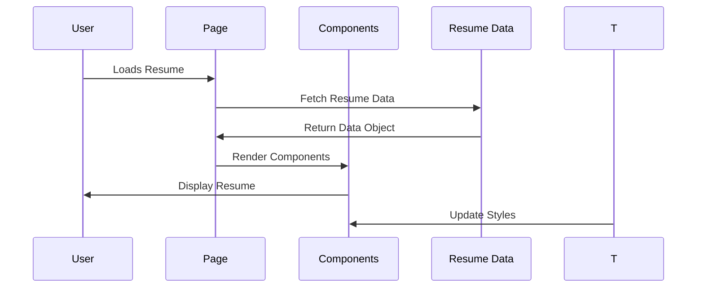
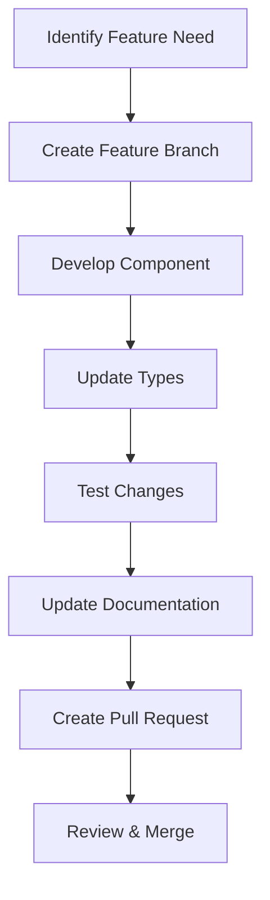

<div align="center"><a name="readme-top"></a>

[](#)

# 🚀 Easy Resume<br/><h3>Modern Professional Resume Builder</h3>

A modern, responsive resume builder built with Next.js 15, React 19, and TypeScript.<br/>
Supports print optimization and seamless deployment.<br/>
Create your **FREE** professional resume in minutes.

[Live Demo][demo-link] · [Documentation][docs-link] · [Report Bug][github-issues-link] · [Request Feature][github-issues-link]

<br/>

[][demo-link]

<br/>

<!-- SHIELD GROUP -->

[![][github-release-shield]][github-release-link]
[![][vercel-shield]][vercel-link]
[![][github-stars-shield]][github-stars-link]
[![][github-forks-shield]][github-forks-link]
[![][github-issues-shield]][github-issues-link]
[![][github-license-shield]][github-license-link]

**Share Easy Resume**

[![][share-x-shield]][share-x-link]
[![][share-linkedin-shield]][share-linkedin-link]
[![][share-reddit-shield]][share-reddit-link]

<sup>🌟 Building professional resumes with modern technology. Designed for developers and professionals worldwide.</sup>

</div>

> [!IMPORTANT]
> This project demonstrates modern full-stack development practices with Next.js 15, React 19, and TypeScript. It combines responsive design to provide a professional resume building experience. Features include print optimization, type safety, and seamless deployment.

<details>
<summary><kbd>📑 Table of Contents</kbd></summary>

#### TOC

- [🚀 Easy Resume](#-easy-resume)
      - [TOC](#toc)
  - [🌟 Introduction](#-introduction)
  - [✨ Key Features](#-key-features)
    - [`1` Responsive Design](#1-responsive-design)
    - [`*` Additional Features](#-additional-features)
  - [🛠️ Tech Stack](#️-tech-stack)
  - [🏗️ Architecture](#️-architecture)
    - [Component Structure](#component-structure)
    - [Data Flow](#data-flow)
  - [⚡️ Performance](#️-performance)
  - [🚀 Getting Started](#-getting-started)
    - [Prerequisites](#prerequisites)
    - [Quick Installation](#quick-installation)
    - [Environment Setup](#environment-setup)
    - [Development Mode](#development-mode)
  - [🛳 Deployment](#-deployment)
    - [`A` Cloud Deployment](#a-cloud-deployment)
    - [`B` Docker Deployment](#b-docker-deployment)
  - [📖 Usage Guide](#-usage-guide)
    - [Basic Customization](#basic-customization)
    - [Advanced Configuration](#advanced-configuration)
    - [Adding New Sections](#adding-new-sections)
  - [🎨 Customization](#-customization)
    - [Updating Resume Data](#updating-resume-data)
    - [Styling](#styling)
    - [Component Modification](#component-modification)
  - [⌨️ Development](#️-development)
    - [Local Development](#local-development)
    - [Adding Features](#adding-features)
    - [Testing](#testing)
  - [🤝 Contributing](#-contributing)
    - [Development Process](#development-process)
    - [Contribution Guidelines](#contribution-guidelines)
  - [📄 License](#-license)
  - [👥 Contact](#-contact)

####

<br/>

</details>

## 🌟 Introduction

Easy Resume is a modern, responsive resume builder designed for professionals who want to create beautiful, printable resumes using cutting-edge web technologies. Built with Next.js 15, React 19, and TypeScript, this project demonstrates best practices in modern web development while providing a practical tool for resume creation.

Whether you're a developer looking to showcase your technical skills or a professional seeking a clean, modern resume format, Easy Resume provides the perfect foundation. The project features responsive design and print optimization to ensure your resume looks great both on screen and on paper.

> [!NOTE]
> - Node.js >= 18.0 required
> - Modern browser with CSS Grid support
> - TypeScript knowledge helpful for customization

| [![][demo-shield-badge]][demo-link]   | No installation required! Visit our live demo to see the resume in action.                           |
| :------------------------------------ | :--------------------------------------------------------------------------------------------- |

> [!TIP]
> **⭐ Star us** to receive all release notifications from GitHub without delay!

[![][image-star]][github-stars-link]

## ✨ Key Features

### `1` Responsive Design

Experience next-generation responsive design that looks perfect on all devices. Our mobile-first approach ensures your resume is accessible and readable on smartphones, tablets, and desktop computers.

Key capabilities include:
- 📱 **Mobile Optimized**: Perfect viewing on all screen sizes
- 🖥️ **Desktop Enhanced**: Takes advantage of larger screens
- 📄 **Print Ready**: Optimized styles for paper printing
- 🎯 **Cross-Browser**: Compatible with all modern browsers

[![][back-to-top]](#readme-top)


### `*` Additional Features

Beyond the core features, this project includes:

- [x] 🎨 **Modern UI/UX**: Beautiful design with smooth transitions and hover effects
- [x] 🔧 **Type-Safe**: Built with TypeScript for reliable development and customization
- [x] ⚡ **Performance Optimized**: Next.js 15 with automatic optimizations
- [x] 🌐 **SEO Ready**: Optimized meta tags and semantic HTML structure
- [x] ♿ **Accessible**: WCAG guidelines compliant with proper ARIA labels
- [x] 🎯 **Component-Based**: Modular architecture for easy customization
- [x] 📝 **Data-Driven**: Centralized resume data management
- [x] 🚀 **One-Click Deploy**: Instant deployment to Vercel or other platforms

> ✨ The project serves as an excellent example of modern React/Next.js development practices.

<div align="right">

[![][back-to-top]](#readme-top)

</div>

## 🛠️ Tech Stack

<div align="center">
  <table>
    <tr>
      <td align="center" width="96">
        
        <br>Next.js 15
      </td>
      <td align="center" width="96">
        
        <br>React 19
      </td>
      <td align="center" width="96">
        
        <br>TypeScript 5
      </td>
      <td align="center" width="96">
        
        <br>Tailwind CSS
      </td>
      <td align="center" width="96">
        
        <br>Vercel
      </td>
    </tr>
  </table>
</div>

**Frontend Stack:**
- **Framework**: Next.js 15 with App Router
- **UI Library**: React 19 with Hooks
- **Language**: TypeScript for type safety
- **Styling**: Tailwind CSS + Custom CSS Variables
- **Icons**: Custom SVG icons with inline styling

**Development Tools:**
- **Linting**: ESLint with Next.js configuration
- **Code Quality**: TypeScript strict mode
- **Build System**: Next.js optimized builds
- **Dev Server**: Next.js development server with hot reload

**Deployment & Hosting:**
- **Platform**: Vercel (recommended) / Netlify / Any static host
- **Build**: Static export capability
- **Performance**: Automatic optimization and caching

> [!TIP]
> Each technology was selected for production readiness, developer experience, and modern web standards compliance.

## 🏗️ Architecture

### Component Structure

```
src/
├── app/                    # Next.js App Router
│   ├── globals.css        # Global styles
│   ├── layout.tsx         # Root layout
│   └── page.tsx           # Main resume page
├── components/            # Resume section components
│   ├── Header.tsx         # Contact information and name
│   ├── Introduction.tsx   # Professional summary
│   ├── Work.tsx           # Work experience section
│   ├── Education.tsx      # Education background
│   ├── Skills.tsx         # Technical and professional skills
│   ├── Projects.tsx       # Project portfolio
│   ├── Achievements.tsx   # Notable achievements
│   ├── Certifications.tsx # Professional certifications
│   ├── Section.tsx        # Reusable section wrapper
├── data/                  # Resume data and types
│   └── resume.ts          # Resume data structure and content
└── styles/                # Additional styling
```


### Data Flow



## ⚡️ Performance

**Key Metrics:**
- ⚡ **< 100ms** Time to First Byte (TTFB)
- 🚀 **< 500ms** First Contentful Paint
- 💨 **< 1s** Largest Contentful Paint
- 📊 **0ms** Cumulative Layout Shift

**Performance Optimizations:**
- 🎯 **Next.js Optimizations**: Automatic code splitting and image optimization
- 📦 **Tree Shaking**: Unused code elimination
- 🔄 **Static Generation**: Pre-rendered HTML for instant loading
- 🖼️ **CSS Optimization**: Minimal CSS bundle with Tailwind purging
- 📱 **Mobile Performance**: Optimized for mobile devices

> [!NOTE]
> Performance metrics are measured using Lighthouse and continuously optimized for the best user experience.

## 🚀 Getting Started

### Prerequisites

> [!IMPORTANT]
> Ensure you have the following installed:

- Node.js 18.0+ ([Download](https://nodejs.org/))
- npm/yarn/pnpm package manager
- Git ([Download](https://git-scm.com/))

### Quick Installation

**1. Clone Repository**

```bash
git clone https://github.com/ChanMeng666/easy-resume.git
cd easy-resume
```

**2. Install Dependencies**

```bash
# Using npm
npm install

# Using yarn
yarn install

# Using pnpm (recommended)
pnpm install
```

**3. Start Development**

```bash
npm run dev
```

🎉 **Success!** Open [http://localhost:3000](http://localhost:3000) to view your resume.

### Environment Setup

The project works out of the box without any environment variables. All configuration is done through the data files and can be customized directly in the code.

### Development Mode

```bash
# Start with hot reload
npm run dev

# Build for production
npm run build

# Start production server
npm run start

# Run linting
npm run lint
```

## 🛳 Deployment

> [!IMPORTANT]
> Choose the deployment strategy that best fits your needs. Cloud deployment is recommended for easy sharing and updates.

### `A` Cloud Deployment

**Vercel (Recommended)**

[](https://vercel.com/new/clone?repository-url=https%3A%2F%2Fgithub.com%2FChanMeng666%2Feasy-resume)

**Manual Deployment:**

```bash
# Install Vercel CLI
npm i -g vercel

# Deploy
vercel --prod
```

**Other Platforms:**

<div align="center">

|           Deploy with Netlify            |                     Deploy with Railway                      |
| :-------------------------------------: | :---------------------------------------------------------: |
| [![][deploy-netlify-button]][deploy-netlify-link] | [![][deploy-railway-button]][deploy-railway-link] |

</div>

### `B` Docker Deployment

```bash
# Build Docker image
docker build -t easy-resume .

# Run container
docker run -p 3000:3000 easy-resume
```

**docker-compose.yml:**

```yaml
version: '3.8'
services:
  app:
    build: .
    ports:
      - "3000:3000"
    environment:
      - NODE_ENV=production
```

## 📖 Usage Guide

### Basic Customization

**Getting Started:**

1. **Clone the Repository** and install dependencies
2. **Update Resume Data** in `src/data/resume.ts`
3. **Customize Styling** in `src/app/globals.css` (optional)
4. **Deploy** to your preferred platform

### Advanced Configuration

**Custom Styling:**


**Resume Data Structure:**

```typescript
// src/data/resume.ts
export const resumeData: ResumeData = {
  basics: {
    name: "Your Name",
    label: "Your Professional Title",
    email: "your.email@example.com",
    phone: "Your Phone Number",
    location: "Your Location",
    summary: "Your professional summary...",
    profiles: [
      {
        network: "LinkedIn",
        url: "https://linkedin.com/in/yourprofile",
        label: "yourprofile"
      }
    ]
  },
  // ... other sections
};
```

### Adding New Sections

**1. Create Component:**

```typescript
// src/components/NewSection.tsx
interface NewSectionProps {
  data: YourDataType[];
}

export function NewSection({ data }: NewSectionProps) {
  return (
    <Section title="New Section">
      {/* Your section content */}
    </Section>
  );
}
```

**2. Update Data Structure:**

```typescript
// src/data/resume.ts
export interface ResumeData {
  // ... existing properties
  newSection: YourDataType[];
}
```

**3. Add to Main Page:**

```typescript
// src/app/page.tsx
import { NewSection } from "@/components/NewSection";

// Add to your page component
<NewSection data={resumeData.newSection} />
```

## 🎨 Customization

### Updating Resume Data

The resume content is managed through a single TypeScript file:

```17:35:src/data/resume.ts
export const resumeData: ResumeData = {
  basics: {
    name: "Chan Meng",
    label: "Web/Mobile App & AI/ML Infrastructure Engineer",
    email: "chanmeng.career@gmail.com",
    phone: "(+64) 028 8523 5858",
    location: "59 Spring Street, Onehunga, Auckland 1061",
    summary: "Full-stack developer with specialized expertise...",
    profiles: [
      {
        network: "Portfolio",
        url: "https://2d-portfolio-eta.vercel.app/",
        label: "chanmeng.live"
      }
    ]
  },
  // ... other sections
};
```

### Styling

**CSS Variables Approach:**

```1:25:src/app/globals.css
:root {
  --background: #f5f5f5;
  --foreground: #171717;
  --background-paper: #ffffff;
  --primary-main: #2563eb;
  --primary-light: #3b82f6;
  --primary-dark: #1d4ed8;
  --text-secondary: #525252;
}

.dark {
  --background: #0a0a0a;
  --foreground: #ededed;
  --background-paper: #1a1a1a;
  --primary-main: #60a5fa;
  --primary-light: #93c5fd;
  --primary-dark: #3b82f6;
  --text-secondary: #a3a3a3;
}
```

### Component Modification

Each resume section is a separate component that can be customized independently:

```8:25:src/components/Header.tsx
export function Header({ basics }: HeaderProps) {
  return (
    <header className="mb-8 sm:mb-10 text-center">
      <h1 className="text-3xl sm:text-4xl font-bold mb-2 text-foreground">
        {basics.name}
      </h1>
      <p className="text-lg sm:text-xl text-primary-main mb-4 max-w-2xl mx-auto">
        {basics.label}
      </p>
      {/* ... rest of component */}
    </header>
  );
}
```

## ⌨️ Development

### Local Development

**Setup Development Environment:**

```bash
# Clone repository
git clone https://github.com/ChanMeng666/easy-resume.git
cd easy-resume

# Install dependencies
npm install

# Start development server
npm run dev
```

**Development Scripts:**

```bash
# Development
npm run dev          # Start dev server with hot reload
npm run build        # Build for production
npm run start        # Start production server
npm run lint         # Run ESLint
```

### Adding Features

**Feature Development Workflow:**



**1. Create Feature Branch:**

```bash
git checkout -b feature/new-resume-section
```

**2. Component Development:**

- Follow TypeScript best practices
- Use existing design patterns
- Maintain responsive design
- Add proper accessibility attributes

### Testing

**Manual Testing Checklist:**

- ✅ Responsive design on all screen sizes
- ✅ Print layout optimization
- ✅ Cross-browser compatibility
- ✅ Accessibility with screen readers
- ✅ Performance on slow connections

## 🤝 Contributing

We welcome contributions! Here's how you can help improve Easy Resume:

### Development Process

**1. Fork & Clone:**

```bash
git clone https://github.com/ChanMeng666/easy-resume.git
cd easy-resume
```

**2. Create Branch:**

```bash
git checkout -b feature/your-feature-name
```

**3. Make Changes:**

- Follow TypeScript best practices
- Maintain responsive design principles
- Add proper documentation
- Test on multiple devices

**4. Submit PR:**

- Provide clear description
- Include screenshots for UI changes
- Reference related issues
- Ensure all checks pass

### Contribution Guidelines

**Code Style:**
- Use TypeScript for all new code
- Follow existing naming conventions
- Add JSDoc comments for complex functions
- Maintain consistent indentation

**Pull Request Process:**
1. Update README.md if needed
2. Test on multiple devices/browsers
3. Ensure accessibility standards
4. Request review from maintainers

[![][pr-welcome-shield]][pr-welcome-link]

## 📄 License

This project is licensed under the MIT License - see the [LICENSE](LICENSE) file for details.

**Open Source Benefits:**
- ✅ Commercial use allowed
- ✅ Modification allowed
- ✅ Distribution allowed
- ✅ Private use allowed

## 👥 Contact

**Chan Meng**
-  LinkedIn: [chanmeng666](https://www.linkedin.com/in/chanmeng666/)
-  GitHub: [ChanMeng666](https://github.com/ChanMeng666)
-  Email: [chanmeng.dev@gmail.com](mailto:chanmeng.dev@gmail.com)
-  Website: [chanmeng.live](https://2d-portfolio-eta.vercel.app/)

---

<div align="center">
<strong>🚀 Building Professional Resumes with Modern Technology 🌟</strong>
<br/>
<em>Empowering professionals with beautiful, responsive resume design</em>
<br/><br/>

⭐ **Star us on GitHub** • 📖 **Read the Documentation** • 🐛 **Report Issues** • 💡 **Request Features** • 🤝 **Contribute**

<br/><br/>

**Made with ❤️ by Chan Meng**


</div>

---

<!-- LINK DEFINITIONS -->

[back-to-top]: https://img.shields.io/badge/-BACK_TO_TOP-151515?style=flat-square

<!-- Project Links -->
[demo-link]: https://easy-resume-theta.vercel.app/
[docs-link]: https://github.com/ChanMeng666/easy-resume#readme

<!-- GitHub Links -->
[github-issues-link]: https://github.com/ChanMeng666/easy-resume/issues
[github-stars-link]: https://github.com/ChanMeng666/easy-resume/stargazers
[github-forks-link]: https://github.com/ChanMeng666/easy-resume/forks
[github-release-link]: https://github.com/ChanMeng666/easy-resume/releases
[pr-welcome-link]: https://github.com/ChanMeng666/easy-resume/pulls
[github-license-link]: https://github.com/ChanMeng666/easy-resume/blob/master/LICENSE

<!-- Shield Badges -->
[github-release-shield]: https://img.shields.io/github/v/release/ChanMeng666/easy-resume?color=369eff&labelColor=black&logo=github&style=flat-square
[vercel-shield]: https://img.shields.io/badge/vercel-online-55b467?labelColor=black&logo=vercel&style=flat-square
[github-stars-shield]: https://img.shields.io/github/stars/ChanMeng666/easy-resume?color=ffcb47&labelColor=black&style=flat-square
[github-forks-shield]: https://img.shields.io/github/forks/ChanMeng666/easy-resume?color=8ae8ff&labelColor=black&style=flat-square
[github-issues-shield]: https://img.shields.io/github/issues/ChanMeng666/easy-resume?color=ff80eb&labelColor=black&style=flat-square
[github-license-shield]: https://img.shields.io/badge/license-MIT-white?labelColor=black&style=flat-square
[pr-welcome-shield]: https://img.shields.io/badge/🤝_PRs_welcome-%E2%86%92-ffcb47?labelColor=black&style=for-the-badge

<!-- Badge Variants -->
[demo-shield-badge]: https://img.shields.io/badge/LIVE%20DEMO-ONLINE-55b467?labelColor=black&logo=vercel&style=for-the-badge
[vercel-link]: https://easy-resume-theta.vercel.app/

<!-- Social Share Links -->
[share-x-link]: https://x.com/intent/tweet?hashtags=resume,nextjs,typescript&text=Check%20out%20this%20amazing%20resume%20builder&url=https%3A%2F%2Fgithub.com%2FChanMeng666%2Feasy-resume
[share-linkedin-link]: https://linkedin.com/sharing/share-offsite/?url=https://github.com/ChanMeng666/easy-resume
[share-reddit-link]: https://www.reddit.com/submit?title=Modern%20Resume%20Builder%20with%20Next.js&url=https%3A%2F%2Fgithub.com%2FChanMeng666%2Feasy-resume

[share-x-shield]: https://img.shields.io/badge/-share%20on%20x-black?labelColor=black&logo=x&logoColor=white&style=flat-square
[share-linkedin-shield]: https://img.shields.io/badge/-share%20on%20linkedin-black?labelColor=black&logo=linkedin&logoColor=white&style=flat-square
[share-reddit-shield]: https://img.shields.io/badge/-share%20on%20reddit-black?labelColor=black&logo=reddit&logoColor=white&style=flat-square

<!-- Deployment Links -->
[deploy-netlify-link]: https://app.netlify.com/start/deploy?repository=https://github.com/ChanMeng666/easy-resume
[deploy-railway-link]: https://railway.app/new/template?template=https://github.com/ChanMeng666/easy-resume

[deploy-netlify-button]: https://www.netlify.com/img/deploy/button.svg
[deploy-railway-button]: https://railway.app/button.svg

<!-- Images -->
[image-star]: https://via.placeholder.com/800x200/FFD700/000000?text=Star+Us+on+GitHub
